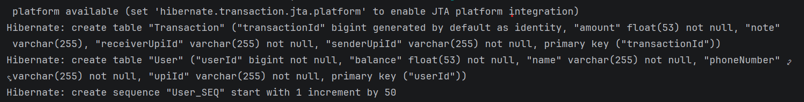
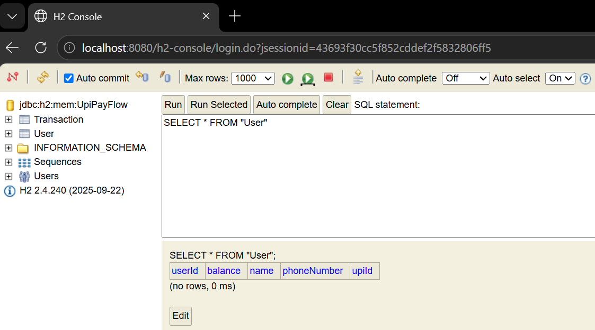
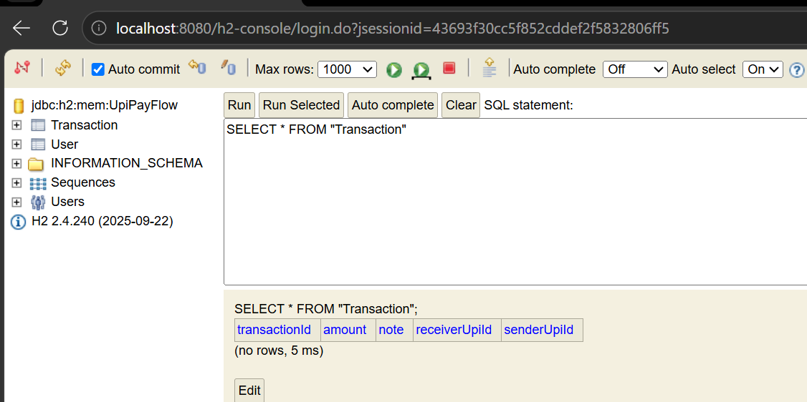

# PayFlow REST API

## Overview

PayFlow is a simplified digital payments backend inspired by platforms such as PhonePe and Google Pay. Every time a user initiates a payment, a backend service receives the request, validates the sender, records the transaction, and updates account information.

This project focuses on building the backend REST API responsible for:

* Registering users
* Maintaining wallet balances
* Looking up users by ID or UPI ID
* Listing all registered users
* Recording money transfer transactions

The application is implemented using **Spring Boot**, **Spring Data JPA**, and an **H2 in-memory database**.

---

## Features

### User Management

* Register a new user
* Retrieve a user by ID
* Retrieve a user by UPI ID
* List all users

### Transaction Management

* Record money transfers between users
* Store sender and receiver UPI IDs
* Persist transaction details in the database

---

## Technology Stack

* Java 17+
* Spring Boot
* Spring Data JPA
* H2 Database
* Gradle
* REST APIs

---

# Project Structure

```text
src
├── main
│   ├── java
│   │   └── com.example.main
│   │       ├── controller
│   │       │   ├── UserController.java
│   │       │   └── TransactionController.java
│   │       ├── entity
│   │       │   ├── User.java
│   │       │   ├── Transaction.java
│   │       │   └── error_response.java
│   │       ├── exception
│   │       │   ├── InvalidAmountException.java
│   │       │   ├── UserNotFound.java
│   │       │   └── UserNotPresentInUpiPayRoleException.java
│   │       ├── repository
│   │       │   ├── UserRepository.java
│   │       │   └── TransactionRepository.java
│   │       ├── service
│   │       │   ├── UserService.java
│   │       │   └── TransactionService.java
│   │       └── MainApplication.java
│   └── resources
│       └── application.properties
```

---

# Entity Design

## User Entity

The User entity represents a registered user in the PayFlow system with the following annotations for validation:
- `@Entity` - Maps the class to a database table
- `@Id` - Marks userId as the primary key
- `@GeneratedValue(strategy = GenerationType.AUTO)` - Auto-generates IDs
- `@NotNull` and `@NotEmpty` - Validates required fields

### Fields

| Field       | Type   | Description                    |
| ----------- | ------ | ------------------------------ |
| userId      | Long   | Primary Key                    |
| name        | String | User name                      |
| upiId       | String | Unique UPI identifier          |
| balance     | Double | Wallet balance                 |
| phoneNumber | String | User's phone number (required) |

The entity includes a parameterized constructor for object creation and getter/setter methods for all fields.

---

## Transaction Entity

The Transaction entity records money transfers between users with validation annotations:
- `@Entity` - Maps the class to a database table
- `@Id` with `@GeneratedValue(strategy = GenerationType.IDENTITY)` - Auto-generates transaction IDs
- `@NotNull` and `@NotEmpty` - Validates required transaction fields

### Fields

| Field          | Type   | Description                |
| -------------- | ------ | -------------------------- |
| transactionId  | Long   | Primary Key                |
| senderUpiId    | String | Sender UPI ID              |
| receiverUpiId  | String | Receiver UPI ID            |
| amount         | double | Amount transferred         |
| note           | String | Transaction note/memo      |

The entity includes a parameterized constructor and getter/setter methods for all fields.

> Note: Relationships between User and Transaction are intentionally omitted for this assignment. Sender and receiver UPI IDs are stored as plain strings.

---

# Task 2 – Database Configuration

## application.properties

The application uses an H2 in-memory database for development and testing. Configuration includes:

- **Database URL**: `jdbc:h2:mem:UpiPayFlow`
- **Username**: `user`
- **Password**: `user`
- **DDL Auto**: `update` - Automatically creates/updates tables based on entities
- **SQL Logging**: Enabled for debugging
- **H2 Console**: Accessible at `/h2-console` for manual database inspection
- **Error Handling**: Configured to include detailed error messages and validation errors in responses
- **Naming Strategy**: Uses camelCase to snake_case conversion for database columns with global quote identifiers enabled

---

## Auto-generated Tables

Spring Data JPA automatically generates tables at startup based on entity definitions. Hibernate applies naming conventions that convert camelCase field names to snake_case column names (e.g., `userId` → `user_id`, `senderUpiId` → `sender_upi_id`).

The USER table includes columns for id, name, upi_id, balance, and phone_number with appropriate data types and constraints.

The TRANSACTION table includes columns for transaction_id, sender_upi_id, receiver_upi_id, amount, and note.

Here are there created tables queries at startup done by hibernate:



# Task 3 – Repository Layer

## UserRepository

The UserRepository extends `JpaRepository<User, Long>` to provide built-in CRUD operations. 

Custom methods include:
- `findByUpiId(String upiId)` - A derived query method that automatically finds a user by their UPI ID. Spring generates the SQL based on the method name convention.
- `findUsersWithBalanceGreaterThan(Double amount)` - Uses a custom `@Query` annotation with JPQL to find all users with a balance greater than the specified amount. Returns an Optional containing a list of users.

## TransactionRepository

The TransactionRepository extends `JpaRepository<Transaction, Long>` to provide built-in CRUD operations for managing transactions in the database. Currently, no custom query methods are defined, as the basic save and retrieve operations are sufficient for transaction management.

---

# Task 4 – Service Layer

## UserService

The UserService is a Spring `@Service` component responsible for business logic related to user management. It uses `@Autowired` dependency injection to automatically inject the UserRepository bean.

**Key Methods:**
- `registerUser(User user)` - Saves a new user to the database
- `getAllUsers()` - Retrieves all registered users
- `findByUpiId(User user)` - Finds a user by their UPI ID
- `getAllUsersWithBalanceGreaterThan(Double balance)` - Retrieves users with balance above a specified amount. Throws `UserNotFound` exception if no users are found.

**Exception Handling:**
The service includes an `@ExceptionHandler` method to handle `UserNotFound` exceptions and return a custom error response with appropriate HTTP status code, message, timestamp, and stack trace.

---

## TransactionService

The TransactionService is a Spring `@Service` component handling business logic for money transfers. It uses `@Autowired` to inject both TransactionRepository and UserRepository.

**Key Method:**
- `sendMoney(String senderUpiId, String receiverUpiId, Double amount)` - Performs a money transfer with comprehensive validation:
  - Verifies both sender and receiver are registered in the system
  - Validates transaction amount is between 1.00 and 200000.00
  - Creates and saves the transaction record

**Exception Handling:**
The service includes `@ExceptionHandler` methods for:
- `UserNotPresentInUpiPayRoleException` - Thrown when sender or receiver is not found
- `InvalidAmountException` - Thrown when transaction amount is outside valid range

Both exceptions return a custom error response with HTTP status, message, timestamp, and stack trace.

---

# Task 5 – REST Controllers

## UserController

**Base URL:** `/users`

**Endpoints:**

1. **Register User** - `POST /users` - Registers a new user. Uses `@Valid` to trigger input validation on the User object.

2. **Get All Users** - `GET /users` - Retrieves a list of all registered users.

3. **Get User By UPI ID** - `GET /users/upi/{upiId}` - Retrieves a specific user by their UPI ID. Returns an Optional containing the user if found.

---

## TransactionController

**Base URL:** `/transactions`

**Endpoints:**

1. **Send Money** - `POST /transactions` - Initiates a money transfer between two registered users. Accepts sender UPI ID, receiver UPI ID, and amount. The service validates both users exist and the amount is within acceptable range before saving the transaction.

---

# API Testing Using cURL

## 1. Register User

```bash
curl -X POST http://localhost:8080/users \
-H "Content-Type: application/json" \
-d '{
"name":"Rahul",
"upiId":"rahul@payflow",
"balance":5000
}'
```

### Response

```json
{
  "id":1,
  "name":"Rahul",
  "upiId":"rahul@payflow",
  "balance":5000.0
}
```

---

## 2. Register Another User

```bash
curl -X POST http://localhost:8080/users \
-H "Content-Type: application/json" \
-d '{
"name":"Priya",
"upiId":"priya@payflow",
"balance":3000
}'
```

### Response

```json
{
  "id":2,
  "name":"Priya",
  "upiId":"priya@payflow",
  "balance":3000.0
}
```

---

## 3. Get All Users

```bash
curl http://localhost:8080/users
```

### Response

```json
[
  {
    "id":1,
    "name":"Rahul",
    "upiId":"rahul@payflow",
    "balance":5000.0
  },
  {
    "id":2,
    "name":"Priya",
    "upiId":"priya@payflow",
    "balance":3000.0
  }
]
```

---

## 4. Get User by UPI ID

```bash
curl http://localhost:8080/users/upi/rahul@payflow
```

### Response

```json
{
  "id":1,
  "name":"Rahul",
  "upiId":"rahul@payflow",
  "balance":5000.0
}
```

---

## 5. Send Money

```bash
curl -X POST http://localhost:8080/transactions \
-H "Content-Type: application/json" \
-d '{
"senderUpiId":"rahul@payflow",
"receiverUpiId":"priya@payflow",
"amount":500
}'
```

### Response

```json
{
  "id":1,
  "senderUpiId":"rahul@payflow",
  "receiverUpiId":"priya@payflow",
  "amount":500.0
}
```

---

# Demonstrating @RequestBody

## With @RequestBody

```java
@PostMapping
public User registerUser(
        @RequestBody User user) {

    System.out.println(user);

    return userService.registerUser(user);
}
```

### Console Output

```text
User(
 id=null,
 name=Rahul,
 upiId=rahul@payflow,
 balance=5000.0
)
```

---

## Without @RequestBody

```java
@PostMapping
public User registerUser(User user) {

    System.out.println(user);

    return userService.registerUser(user);
}
```

### Console Output

```text
User(
 id=null,
 name=null,
 upiId=null,
 balance=null
)
```

### Explanation

`@RequestBody` tells Spring Boot to read the incoming JSON request body and convert it into a Java object using Jackson. Without `@RequestBody`, Spring attempts to bind values from request parameters rather than the JSON payload. Since the data is being sent as JSON in the body of the HTTP request, Spring cannot populate the fields and creates an object whose attributes remain null. Therefore, `@RequestBody` is required whenever a REST endpoint expects JSON data.

---

# Task 6 – Custom Query

## Derived Query

Spring Data JPA automatically generates SQL queries based on method naming conventions. For example, a method named `findByUpiId(String upiId)` automatically generates a query that filters users by UPI ID without requiring explicit `@Query` annotations.

### How JPA Derives the Query

The method name `findByUpiId` is parsed by Spring Data JPA's query builder:
- **`find`** - Indicates a SELECT query that returns results
- **`By`** - Signals the start of the WHERE clause conditions
- **`UpiId`** - Maps to the entity field `upiId` (Spring converts camelCase to match Java field names)

Spring Data JPA translates this into the following SQL:

```sql
SELECT u FROM User u WHERE u.upiId = ?
```

### Understanding the ? Placeholder

The `?` is a **parameterized query placeholder** (also called a bind variable). When you call `findByUpiId("rahul@payflow")`, the value `"rahul@payflow"` replaces the `?` at runtime:

```sql
SELECT u FROM User u WHERE u.upiId = 'rahul@payflow'
```

**Why use `?` instead of string concatenation?**
- **SQL Injection Prevention** - Malicious input like `rahul' OR '1'='1` cannot escape the string boundaries
- **Query Plan Caching** - Database engines reuse compiled query plans for the same SQL structure
- **Performance** - No string parsing or escaping overhead at runtime

This is an example of **prepared statements**, a security best practice that Spring Data JPA handles automatically behind the scenes.

## JPQL Query

For more complex queries that don't fit naming conventions, Spring supports custom JPQL (Java Persistence Query Language) queries using the `@Query` annotation. Parameters are bound using `@Param` annotations.

Example: `findUsersWithBalanceGreaterThan(Double amount)` uses a custom JPQL query to retrieve all users with a balance exceeding a specified amount. This demonstrates how to write parameterized queries for more sophisticated database operations.

# H2 Console

The H2 database console provides a web-based interface to inspect and query the in-memory database. Access it at `http://localhost:8080/h2-console`.

**Connection Details:**
- JDBC URL: `jdbc:h2:mem:UpiPayFlow`
- Username: `user`
- Password: `user`





---

# Validation & Exception Handling

## Custom Exceptions

The application includes custom exception classes for better error handling:

### UserNotFound
Thrown when a user with a specific UPI ID is not found.

### UserNotPresentInUpiPayRoleException
Thrown when sender or receiver is not registered in the system during a transaction.

### InvalidAmountException
Thrown when transaction amount is outside the valid range (1.00 - 200000.00).

## Input Validation

User and Transaction entities use Jakarta validation annotations:

- `@NotNull` - Field cannot be null
- `@NotEmpty` - Field cannot be empty

All endpoints that accept request bodies use `@Valid` annotation to trigger validation.

## Error Response

Errors are wrapped in a custom `error_response` object containing:
- HTTP Status Code
- Error Message
- Timestamp (in epoch milliseconds)
- Stack Trace

---

# Learning Outcomes

By completing this project, you will gain hands-on experience with:

* Spring Boot application setup
* JPA entity mapping
* Spring Data JPA repositories
* Derived query methods
* JPQL queries
* Dependency Injection using `@Autowired`
* Service layer architecture
* REST API development
* JSON request handling using `@RequestBody`
* H2 database usage and inspection
* API testing using cURL.
